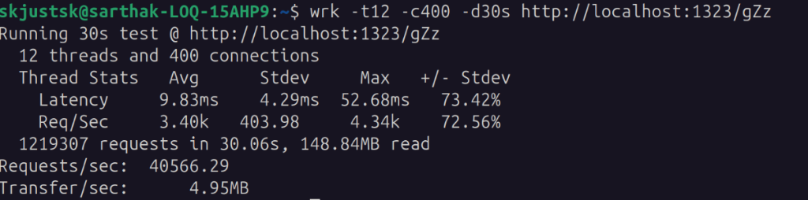

# ALRU URL Shortener

ALRU is a sleek, high-performance URL shortening and analytics platform. It uses a Go and Redis dual-layer redirection engine to serve redirects with minimal latency, utilizing an asynchronous write-behind worker that logs telemetry to PostgreSQL for real-time dashboard visualization.

## Main Features

* **Zero-Collision Shortening:** Uses Base62 encoding mapped to auto-incrementing database IDs for mathematically unique short codes.
* **Custom Aliases:** Supports custom vanity URLs safely isolated in a separate `/c/:alias` routing namespace to prevent conflicts.
* **High-Speed Redirects:** Integrates Redis caching to bypass database lookups for frequently accessed links.
* **Asynchronous Analytics:** Captures click telemetry (IP hashing, devices, location) via background Go routines to ensure zero-latency redirects.
* **Interactive Dashboard:** Timezone-aware UI with Recharts for visualizing daily/hourly click trends, referrers, and geographic data.
* **Security & Privacy:** Features stateless JWT authentication, and SHA-256 IP hashing.

## Tech Stack

**Backend**
* Go (Golang)
* Echo v5 (Web Framework)
* PostgreSQL & GORM (Relational Database & ORM)
* Redis (In-Memory Cache)

**Frontend**
* React & Vite
* Tailwind CSS
* Recharts (Data Visualization)
* Lucide React (Icons)

## Getting Started (Docker Compose)

The easiest way to run the entire stack locally or deploy it to a Virtual Private Server (VPS) is using Docker Compose.

### Prerequisites

Make sure you have [Docker](https://docs.docker.com/get-docker/) installed and running on your machine.

### Running the Application

1. Clone the repository and navigate to the project root.
2. Build and start all services in the background:
   ```bash
   docker compose up -d --build
   ```
3. The services will be accessible at:
   * **Frontend Web Portal**: [http://localhost](http://localhost) (Port `80`)
   * **Backend API**: [http://localhost:1323](http://localhost:1323) (Port `1323`)

### Stopping the Application

To stop and remove containers (while preserving database data):
```bash
docker compose down
```

To stop containers and delete database and cache volumes:
```bash
docker compose down -v
```

## Performance Benchmarking

To measure software-level redirection throughput and latency, load tests were executed using `wrk` against the Redis-cached redirection handler.

### Running the Benchmark

1. Install `wrk` on your machine (e.g. `sudo apt install wrk` on Debian/Ubuntu).
2. Create and access a shortlink once to ensure it is cached in Redis (self-warming cache).
3. Run the load test with 12 threads and 400 concurrent connections for 30 seconds:
   ```bash
   wrk -t12 -c400 -d30s http://localhost:1323/your_short_code
   ```

### Results

The Go backend and Redis dual-layer setup processed **42,511 requests per second** with a **9.44ms average latency**, successfully handling **1.27 million requests** with **0 errors**:

